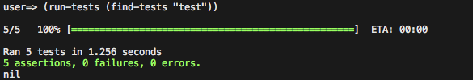
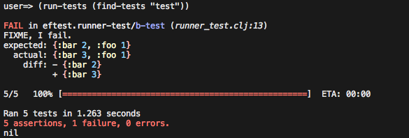
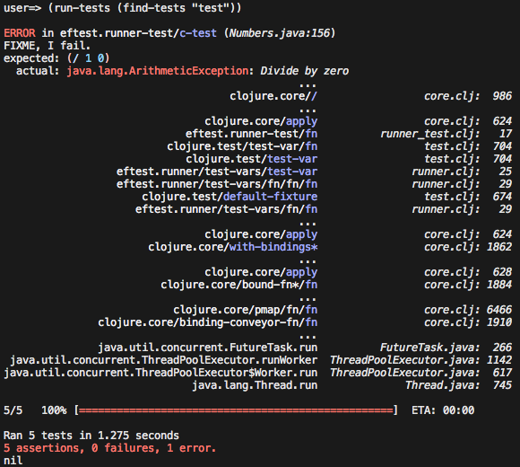

# Eftest

[](https://travis-ci.org/weavejester/eftest)

Eftest is a fast and pretty Clojure test runner.

## Installation

To install, add the following to your project `:dependencies`:

    [eftest "0.5.8"]

Alternatively, if you just want to use Eftest as a `lein test`
replacement, add the following to your project `:plugins`:

    [lein-eftest "0.5.8"]

## Screenshots

When all the tests pass, it looks like this:



When a test fails, it looks like:



And when a test throws an exception, it looks like:



## Usage

### Library

Eftest has two main functions: `find-tests` and `run-tests`.

The `find-tests` function searches a source, which can be a namespace,
directory path, symbol, var, or a collection of any of the previous.
It returns a collection of test vars found in the source.

The `run-tests` function accepts a collection of test vars and runs
them, delivering a report on the tests as it goes.

Typically these two functions are used together:

```clojure
user=> (require '[eftest.runner :refer [find-tests run-tests]])
nil
user=> (run-tests (find-tests "test"))
...
```

The above example will run all tests found in the "test" directory.

#### Multithreading

By default Eftest runs all tests in parallel, which can cause issues
with tests that expect to be single-threaded. To disable this and set
all tests to be executed in serial, set the `:multithread?` option to
`false`:

```clojure
user=> (run-tests (find-tests "test") {:multithread? false})
```

If you want the test vars inside a namespace to be executed in
parallel, but the namespaces themselves to be executed in serial, then
set the `:multithread?` option to `:vars`:

```clojure
user=> (run-tests (find-tests "test") {:multithread? :vars})
```

If you want the vars inside a namespace to execute in serial, but the
namespaces to be executed in parallel, set the `:multithread?` option
to `:namespaces`:

```clojure
user=> (run-tests (find-tests "test") {:multithread? :namespaces})
```

Alternatively, you can add the `:eftest/synchronized` key as metadata
to any tests you want to force to be executed in serial:

```clojure
(deftest ^:eftest/synchronized a-test
  (is (= 1 1)))
```

Or you can synchronize the entire namespace:

```clojure
(ns ^:eftest/synchronized foo.core-test
  (:require [clojure.test :refer :all]
            [foo.core :refer :all]))
```

##### Setting the number of threads used

When multithreading is enabled, Eftest uses a single fixed-threadpool
[`ExecutorService`][executorservice] to run all selected tests.

By default, Eftest will instantiate the threadpool with the number of processors
(cores) available to the JVM, as reported by
[`Runtime.availableProcessors`][availableprocessors]. (NB: in some
circumstances, such as [in a CircleCI test container][resource-class],
`Runtime.availableProcessors` returns an erroneous value.)

[executorservice]: https://docs.oracle.com/en/java/javase/11/docs/api/java.base/java/util/concurrent/ExecutorService.html
[availableprocessors]: https://docs.oracle.com/en/java/javase/11/docs/api/java.base/java/lang/Runtime.html#availableProcessors()
[resource-class]: https://circleci.com/docs/2.0/configuration-reference/#resource_class

Users can override the default behavior by including the key `:thread-count`
in the options map supplied to `run-tests` with the value being any
positive integer:

```clojure
user=> (run-tests (find-tests "test") {:thread-count 4})
```

#### Reporting

You can also change the reporting function used. For example, if you
want a colorized reporter but without the progress bar:

```clojure
user=> (run-tests (find-tests "test") {:report eftest.report.pretty/report})
```

Or JUnit output:

```clojure
user=> (run-tests (find-tests "test") {:report eftest.report.junit/report})
```

Or maybe you just want the old Clojure test reporter:

```clojure
user=> (run-tests (find-tests "test") {:report clojure.test/report})
```

If you want to redirect reporting output to a file, use the
`eftest.report/report-to-file` function:

```clojure
user=> (require '[eftest.report :refer [report-to-file]])
nil
user=> (require '[eftest.report.junit :as ju])
nil
user=> (run-tests (find-tests "test") {:report (report-to-file ju/report "test.xml")})
```

#### Output capturing

By default the STDOUT and STDERR from each test is captured, and
displayed only if the test fails. This includes all the output
generated by the test itself, and any output generated by other
threads not currently running a test.

To turn off this behavior, set the `:capture-output?` option to
`false`:

```clojure
user=> (run-tests (find-tests "test") {:capture-output? false})
```

#### Fast failure

Sometimes it's useful to end the testing on the first test failure. To
do this set the `:fail-fast?` option to `true`:

```clojure
user=> (run-tests (find-tests "test") {:fail-fast? true})
```

#### Long test reporting

If you wish to monitor the length of time to run each test, you can
set the `:test-warn-time` option to the threshold in milliseconds you
wish to warn on long test for. The measured duration includes the
running of `:each-fixtures`, but not `:once-fixtures`.

If you know a particular test to be slow and are ok with that, and
don't want to continually be warned about it, you can add the metadata
`:eftest/slow` to either the individual test, or the entire namespace,
to prevent reporting.

Note that currently only the `pretty` and `progress` reporters support
logging long tests.

```clojure
;; Warns for all tests that take longer than 500ms
user=> (run-tests (find-tests "test") {:test-warn-time 500})
```

### Plugin

To use the Lein-Eftest plugin, just run:

```sh
lein eftest
```

You can customize the reporter and configure the concurrency settings
by adding an `:eftest` key to your project map:

```clojure
:eftest {:multithread? :vars
         :thread-count 4
         :report eftest.report.junit/report
         ;; You can optionally write the output to a file like so:
         :report-to-file "target/junit.xml"}
```

Leiningen test selectors also work. With namespaces:

```sh
lein eftest foo.bar-test foo.baz-test
```

And with metadata keywords:

```sh
lein eftest :integration
```

## License

Copyright © 2019 James Reeves

Distributed under the Eclipse Public License either version 1.0 or (at
your option) any later version.
